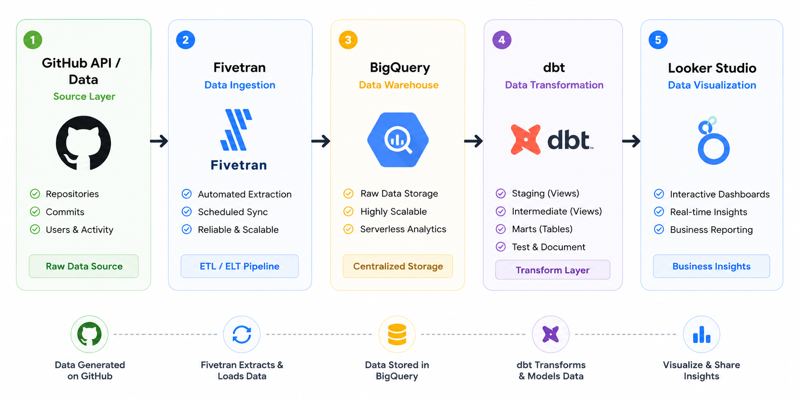

# GitHub Analytics dbt Project


A modern Analytics Engineering project built with **dbt Cloud** and **Google BigQuery**.

This project demonstrates how to transform raw GitHub data into clean, reusable analytical models using a layered dbt architecture. The pipeline follows analytics engineering best practices by separating transformations into staging, intermediate, and marts layers while applying data quality tests and documentation.

The final models are optimized for reporting and analytics, providing reliable datasets for repository activity, commit trends, and user insights.


## Tech Stack

- **Data Warehouse:** Google BigQuery
- **Transformation:** dbt Cloud
- **Language:** SQL
- **Data Ingestion:** Fivetran
- **Version Control:** Git & GitHub
- **Source Data:** GitHub API


## Business Metrics

The analytical models provide repository performance insights through the following KPIs:

- **Total Commits** – Overall development activity.
- **Active Contributors** – Number of developers contributing.
- **Repository Activity** – Daily repository engagement.
- **Daily Commits** – Commits by date.
- **7-Day Moving Average** – Smooths daily fluctuations to identify trends.
- **Repository Performance** – Overall repository health and activity.


## Architecture

The project follows a modern layered dbt architecture that separates data transformations into three logical layers.





```

### Layer Description

| Layer | Purpose | Materialization |
|--------|---------|-----------------|
| **Staging** | Cleans and standardizes raw GitHub data | View |
| **Intermediate** | Applies reusable business logic and transformations | View |
| **Marts** | Creates business-ready fact and dimension tables | Table |


## Project Structure

The project is organized using dbt best practices with separate staging, intermediate, and marts layers.

```text
.
├── macros/
├── models/
│   └── github_analytics_dbt/
│       ├── staging/
│       │   └── github/
│       │       ├── _github__sources.yml
│       │       ├── _github__models.yml
│       │       ├── stg_github__commit.sql
│       │       ├── stg_github__repositories.sql
│       │       └── stg_github__user.sql
│       │
│       ├── intermediate/
│       │   └── github/
│       │       ├── _intermediate__models.yml
│       │       ├── int_github__commit_activity.sql
│       │       └── int_github__repository_stats.sql
│       │
│       └── marts/
│           └── analytics/
│               ├── _analytics__models.yml
│               ├── dim_github__repositories.sql
│               ├── dim_github__user.sql
│               ├── fct_daily_repo_stats.sql
│               ├── fct_github_commit_activity.sql
│               ├── fct_github_commit_activity_7d.sql
│               └── fct_repo_activity_daily.sql
│
├── seeds/
├── snapshots/
├── dbt_project.yml
└── README.md
```


## Data Models


### Staging Layer

The staging layer standardizes raw GitHub data from BigQuery sources. These models clean column names, select relevant fields, and prepare raw data for downstream transformations.

| Model | Purpose |
|------|---------|
| `stg_github__repositories` | Standardizes repository metadata |
| `stg_github__commit` | Standardizes commit records |
| `stg_github__user` | Standardizes GitHub user data |


### Intermediate Layer

The intermediate layer contains reusable transformation logic used by final marts.

| Model | Purpose |
|------|---------|
| `int_github__commit_activity` | Prepares commit activity data for fact models |
| `int_github__repository_stats` | Prepares repository statistics for downstream marts |


### Marts Layer

The marts layer contains final analytics-ready models used for reporting.

| Model | Type | Purpose |
|------|------|---------|
| `dim_github__repositories` | Dimension | Repository attributes |
| `dim_github__user` | Dimension | GitHub user attributes |
| `fct_daily_repo_stats` | Fact | Daily repository-level statistics |
| `fct_github_commit_activity` | Fact | Commit activity by repository, author, and date |
| `fct_github_commit_activity_7d` | Fact | Seven-day rolling commit activity |
| `fct_repo_activity_daily` | Fact | Daily repository activity metrics |


## Data Quality & Testing

The project includes built-in dbt tests to ensure data quality and model reliability.

Implemented tests include:

- `unique`
- `not_null`

Key columns tested:

| Model | Tested Columns |
|-------|----------------|
| `stg_github__repositories` | `repository_id` |
| `stg_github__user` | `user_id` |
| `stg_github__commit` | `commit_sha` |
| `dim_github__repositories` | `repository_id` |
| `dim_github__user` | `user_id` |
| `fct_daily_repo_stats` | `created_date` |


## Materialization Strategy

The project follows a layered dbt architecture with different materializations for each layer.

| Layer | Materialization | Reason |
|--------|-----------------|--------|
| Staging | View | Lightweight transformations on raw source data without storing additional data. |
| Intermediate | View | Reusable business logic that feeds downstream models while minimizing storage. |
| Marts | Table | Analytics-ready models optimized for reporting performance and dashboard queries. |

This approach keeps the transformation pipeline modular, reduces storage costs, and improves query performance for BI tools.


## Data Flow

The project follows a modern ELT workflow using GitHub, BigQuery, and dbt.

```text
GitHub API
      │
      ▼
Raw GitHub Tables (BigQuery)
      │
      ▼
Staging Models (Views)
      │
      ▼
Intermediate Models (Views)
      │
      ▼
Dimension & Fact Models (Tables)
      │
      ▼
Analytics / BI Dashboards
```


### Pipeline Overview

1. GitHub data is loaded into BigQuery raw tables.
2. dbt staging models clean and standardize the raw data.
3. Intermediate models apply reusable business logic.
4. Final dimension and fact models create analytics-ready datasets.
5. BI tools query the marts layer for reporting and visualization.


## dbt Lineage (DAG)

The project uses dbt's dependency graph to organize transformations into a layered architecture. The DAG illustrates how raw GitHub data flows through staging, intermediate, and marts models.


## How to Run

Clone the repository:

```bash
git clone https://github.com/i-myk/github-analytics-elt-pipeline.git
cd github-analytics-elt-pipeline

dbt deps
dbt build --select github_analytics_dbt
```

The command builds the complete GitHub Analytics dbt project, including staging, intermediate, and mart models.


Install dependencies:

```bash
dbt deps
```


Build all models and run tests:

```bash
dbt build
```


Generate documentation:

```bash
dbt docs generate
```


Launch the documentation site:

```bash
dbt docs serve
```


---


## Dashboard Preview

The final dbt mart models are used in Looker Studio to visualize repository activity, commit trends, contributors, and repository performance.

## 🚀 Live Dashboard

[Open Looker Studio Dashboard](https://datastudio.google.com/reporting/7478f0af-71f2-464e-accb-4e4e010b19a9)**


## Key Features

- Layered dbt architecture (Staging → Intermediate → Marts)
- Modular SQL transformations
- Star schema data modeling
- Data quality testing with dbt
- YAML model documentation
- Google BigQuery integration
- GitHub data transformation pipeline
- Analytics-ready fact and dimension models


## Future Improvements

- Implement incremental models for large datasets
- Add snapshot models to track historical changes
- Expand data quality tests
- Integrate CI/CD with GitHub Actions
- Add dbt exposures and metrics


## Author

Created by **Igor Mykoliv** as part of an Analytics Engineering portfolio demonstrating dbt and BigQuery best practices.
